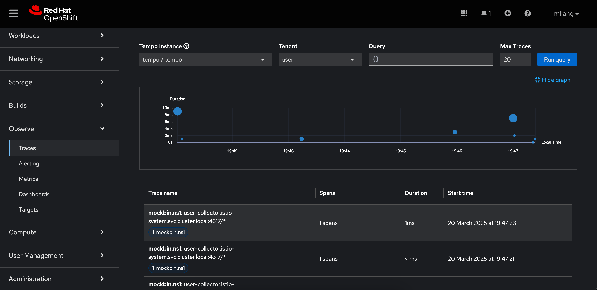
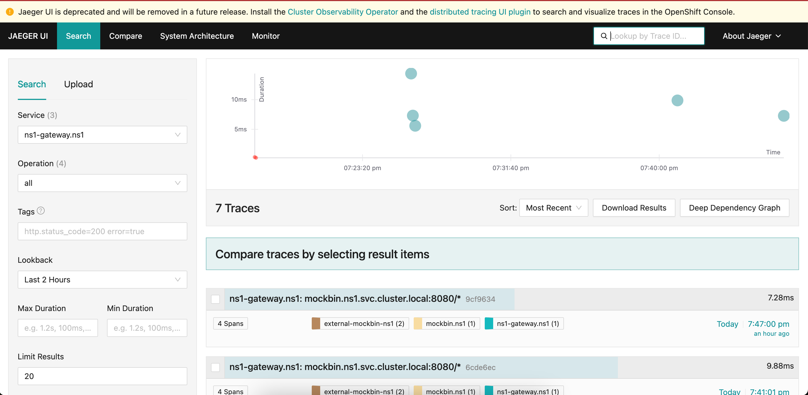

# ServiceMesh 3.x migrating to Tempo and Cluster Observability

With the move of OpenTelemetry, Jaeger is considered deprecated and Tempo Stack's are the way to go.
In OpenShift we have the possibility to use the Tempo-Product Operator as well as the Cluster-Observability Operator
to have access to traces.

The repository will guide you to using COO(ClusterObservabilityOperator) and TempoStack and TempoMonolithic.
For integrating Traces into your `Observe` tab we an utilize COO's UI plugin.

The following steps have been verified on OpenShift 4.16

## Repository structure

### OSSM (OpenShift ServiceMesh)

in the `ossm` directory you will find all necessary CR's to create a ServiceMesh 3.0 `InPlace` deployment.
Follow these steps:

* install the Operator 
    ```
    oc create -k ossm/operator
    ``` 

* verify that the Operator was successfully installed 
    ```
    oc -n openshift-operators get csv servicemeshoperator3.v3.0.0
    ``` 
* install the Istio instance and default CNI
    ```
    oc create -k ossm/mesh
    ```
* **NOTE** the first step does not configure mTLS strict mode 

* verify that the Istio Pilot and CNI have been deployed correctly
    ```
    oc -n istio-system get Istio basic
    oc -n istio-cni get IstioCNI
    ```

### TempoStack for Cluster Observability Operator with UI plugin 

in the `tempoStack-coo` directory you will find all necessary CR's to create a TempoStack with multi tenancy and UI integration. 
**NOTE** the `ingester` requires a PVC and the POC uses hostpath to satisfy that.
Follow these steps:

* install the Tempo-Product Operator
    ```
    oc create -k tempoStack-coo/operator
    ```

* verify that the Operator was successfully installed
    ```
    oc -n openshift-tempo-operator get csv tempo-operator.v0.15.3-1
    ``` 

* install the Opentelemetry Operator 
    ```
    oc create -k tempoStack-coo/operator-otel
    ```

* verify that the Operator was succesfully installed 
    ```
    oc -n openshift-tempo-operator get csv opentelemetry-operator.v0.119.0-1
    ``` 

* install the Cluster Observability Operator
    ```
    oc create -k tempoStack-coo/operator-coo
    ```

* verify that the Operator was succesfully installed
    ```
    oc -n openshift-tempo-operator get csv cluster-observability-operator.v1.0.0
    ``` 

* install the COO UI Plugin 
    ```
    oc create -k tempoStack-coo/observability-plugin/tracing-plugin.yml
    ```

* verify that the Plugin was deployed succesfully
    ```
    oc -n openshift-tempo-operator get UIPlugin distributed-tracing -o yaml
    ```

* install the TempoStack with Multi Tenancy enabled
    ```
    oc create -k tempoStack-coo/tempoStack
    ```

* **NOTE** Depending on your Storage capbilities in the Cluster the rollout might fail on the ingester.

* verify that the TempoStack has been deployed succesfully
    ```
    oc -n tempo get TempoStack tempo
    oc -n tempo get pods
    ```

* if the `ingester` deployment is failing or pending you might want to check on your PVC. 

* the POC contains a [hostpath example](tempoStack-coo/hostpath/README.md) 

### TempoMonolithic for Jaeger UI

in the `tempoMonolithic` directory you will find all necessary CR's to create a Monolithic TempoStack.
Follow these steps:

* install the TempoMonolithic Stack
    ```
    oc create -k tempoMonolithic
    ```

* verify that the TempoStack was deployed succesfully 
    ```
    oc -n tempomonolithic get TempoMonolithic
    oc -n tempomonolithic get pods
    ```

## Accessing the Observe Trace UI



## Accessing the Jaeger UI

* extract the UI address for the Jaeger UI from the Tempo Monolithic deployment
    ```
    oc -n tempomonolithic get route tempo-tempo-jaegerui -o jsonpath='{.spec.host}' ; echo 
    ```


